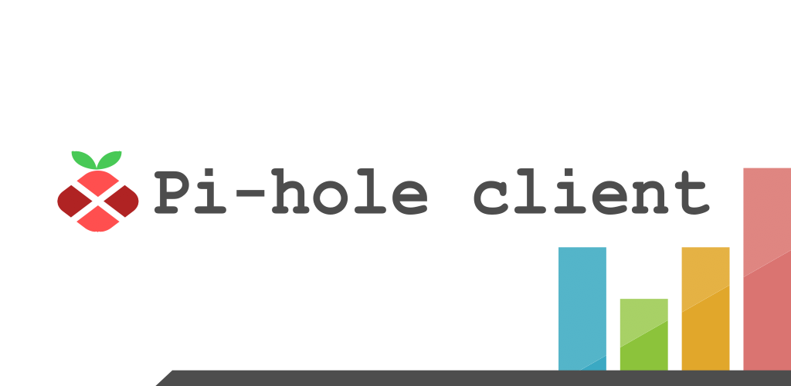
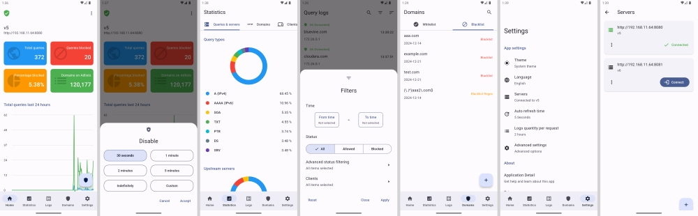

<a id="readme-top"></a>

<!-- PROJECT SHIELDS -->
<!-- https://www.markdownguide.org/basic-syntax/#reference-style-links -->
[![Issues][issues-shield]][issues-url]
[![MIT License][license-shield]][license-url]
[![CodeCov][codecov-shield]][codecov-url]
[![Codaocy][codacy-shield]][codacy-url]
[![SonarQube][sonar-quality-gate-shield]][sonar-quality-gate-url]
![Status][status-shield]
<!-- [![CodeClimate][codeclimate-shield]][codeclimate-url] -->

<!-- PROJECT LOGO -->
<div align="center">
  <a href="https://github.com/tsutsu3/pi-hole-client">
    
  </a>
  <p align="center">
    <b>
      Pi-hole client is an unnoficial
      <a href="https://pi-hole.net/" target="_blank" rel="noopener noreferrer">
        Pi-hole®
      </a>
      client
    </b>
  </p>
</div>

<!-- <p align="center">
  <a href="https://play.google.com/store/apps/details?id=io.github.tsutsu3.pi_hole_client" target="_blank" rel="noopener noreferrer">
    
  </a>
  <a href="https://github.com/tsutsu3/pi-hole-client/releases" target="_blank" rel="noopener noreferrer">
    
  </a>
</p> -->

## 📚 Table of Contents

- [📚 Table of Contents](#-table-of-contents)
- [🎉 About The Project](#-about-the-project)
- [💡 Main features](#-main-features)
- [📌 Requirements](#-requirements)
- [🔑 Privacy policy](#-privacy-policy)
- [📜 Disclaimer](#-disclaimer)
- [🌟 Recommended lists](#-recommended-lists)
- [💖 Donations](#-donations)
- [🛠️ Development](#️-development)
  - [Prepare the development environment](#prepare-the-development-environment)
  - [Compile the production build](#compile-the-production-build)
  - [Code Quality and Analysis](#code-quality-and-analysis)
- [⚖️ License](#️-license)
- [🖋️ Credits](#️-credits)

## 🎉 About The Project

The easy way to manage your Pi-hole® server.

Easily view statistics, enable or disable the server, access logs, and much more.

## 💡 Main features



<p>▶ Manage your Pi-hole® server on an easy way.</p>
<p>▶ Supports Pi-hole v6.</p>
<p>▶ Enable and disable the server with only one button.</p>
<p>▶ Beautiful charts with all the statistics you need to see.</p>
<p>▶ Add multiple servers to the app, and manage all of them from here.</p>
<p>▶ Explore the query logs list and see the log details.</p>
<p>▶ Manage your domain lists. Add and remove domains to the whitelist or blacklist.</p>
<p>▶ Material User interface with dynamic theming (only Android 12+)</p>

## 📌 Requirements

- Fully supports Pi-hole v6
- Requires Pi-hole v5.12 or greater
- Requires web interface v5.14.2 or greater

## 🔑 Privacy policy

Check the privacy policy [here](https://github.com/tsutsu3/pi-hole-client/wiki/Privacy-policy).

## 📜 Disclaimer

This is an unofficial application. The Pi-hole team and the development of the Pi-hole software is not related in any way with this application.

## 🌟 Recommended lists

On [this repository](https://github.com/JuanRodenas/Pihole_list) you can find some recommended lists. Thanks to [JuanRodenas](https://github.com/juanico10).

## 💖 Donations

If you like the project and you want to contribute with the development, you can [become a sponsor on GitHub](https://github.com/sponsors/tsutsu3), or [buy me a coffe](https://buymeacoffee.com/tsutsu3).

<!-- <div align="center">
  <a href="https://www.paypal.com/donate/?hosted_button_id=T63UK6AVL3MG8">
    
  </a>
</div> -->

## 🛠️ Development

### Prepare the development environment

1. Clone the repository
2. Run ``flutter pub get``
3. Clone the ``.env.sample`` file and name it ``.env``
4. On the ``SENTRY_DSN`` variable assign it's value
5. Inside the ``android`` folder, clone the ``key.properties.sample`` file and name it ``key.properties``
6. Open the file and fill the variables with the corresponding values
7. Store your ``keystore.jks`` file inside ``android/app``

### Compile the production build

#### Android

1. Run ``flutter clean``
2. Run ``flutter pub get``
3. Run ``flutter build apk --release`` to build the .apk file
4. Run ``flutter build appbundle --release`` to build the .aab file

#### macOS

1. Run ``flutter clean``
2. Run ``flutter pub get``
3. Run ``flutter build macos --release`` to build the .app file

#### Linux

1. Run ``flutter clean``
2. Run ``flutter pub get``
3. Run ``flutter build linux --release`` to build the Linux executable
4. If you want to build also the .deb file do this:
  4.1. Run ``dart pub global activate flutter_to_debian`` to install the utility that will build the .deb file
  4.2. Run ``flutter_to_debian``

#### Windows

1. Run ``flutter clean``
2. Run ``flutter pub get``
3. Run ``flutter build windows --release`` to build the Windows executable
4. Install the [InnoSetup](https://jrsoftware.org/isdl.php) software you don't have it
5. Run ``iscc /Q windows/innosetup_installer_builder.iss`` to generate the Windows installer

### Code Quality and Analysis

To ensure code quality and identify potential issues, perform the following analysis steps:

1. **Calculate Code Metrics**

   Generate code metrics for the lib directory:

   ```bash
   dcm calculate-metrics lib
   ```

2. **Analyze Code**

   Analyze the project to catch syntax errors, type issues, and other code problems:

   ```bash
   flutter analyze
   dcm analyze lib
   ```

3. **Check Unused Files**

  Identify unused files in the lib directory:

  ```bash
  dcm check-unused-files lib
  ```

## ⚖️ License

This app distributed under the Apach 2.0 License. See [LICENSE](./LICENSE) for more information.

## 🖋️ Credits

This project is based on [DroidHole](https://github.com/jgeek00/droid-hole), originally developed by [JGeek00](https://github.com/JGeek00).

For details on the licenses applicable to this project, please refer to [LICENSE.md](./LICENSE.md).

<p align="right">(<a href="#readme-top">back to top</a>)</p>

<!-- MARKDOWN LINKS & IMAGES -->
<!-- https://www.markdownguide.org/basic-syntax/#reference-style-links -->
[status-shield]: https://img.shields.io/badge/status-alpha-orange?style=for-the-badge
[issues-shield]: https://img.shields.io/github/issues/tsutsu3/pi-hole-client?style=for-the-badge
[issues-url]: https://github.com/tsutsu3/pi-hole-client/issues
[license-shield]: https://img.shields.io/github/license/tsutsu3/pi-hole-client?style=for-the-badge
[license-url]: https://github.com/tsutsu3/pi-hole-client/blob/master/LICENSE
[codecov-shield]: https://img.shields.io/codecov/c/github/tsutsu3/pi-hole-client?token=O6MIIYA211&style=for-the-badge&logo=codecov
[codecov-url]: https://codecov.io/gh/tsutsu3/pi-hole-client
[codeclimate-shield]: https://img.shields.io/codeclimate/maintainability/tsutsu3/pi-hole-client?style=for-the-badge&logo=codeclimate
[codeclimate-url]: https://codeclimate.com/github/tsutsu3/pi-hole-client/maintainability
[codacy-shield]: https://img.shields.io/codacy/grade/a8a50d5271be491ab68c69513f808ada?style=for-the-badge&logo=codacy
[codacy-url]: https://app.codacy.com/gh/tsutsu3/pi-hole-client/dashboard
[sonar-quality-gate-shield]: https://img.shields.io/sonar/quality_gate/tsutsu3_pi-hole-client?server=https://sonarcloud.io&style=for-the-badge&logo=sonarqube
[sonar-quality-gate-url]: https://sonarcloud.io/summary/new_code?id=tsutsu3_pi-hole-client
