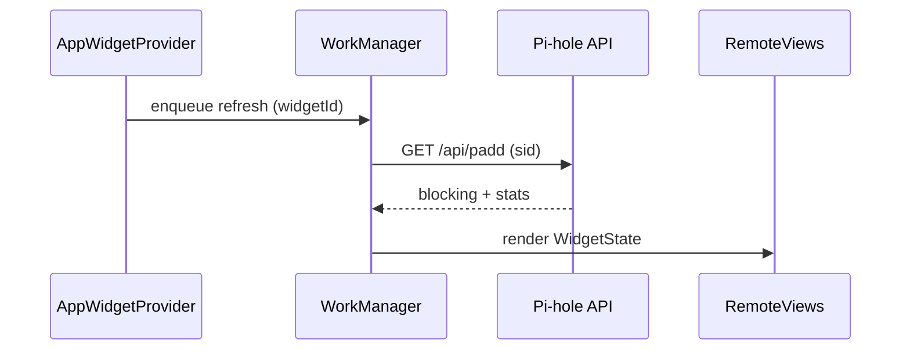
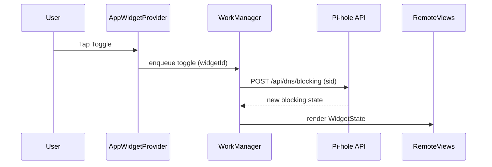
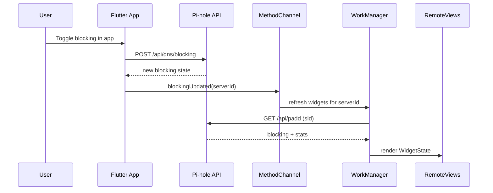
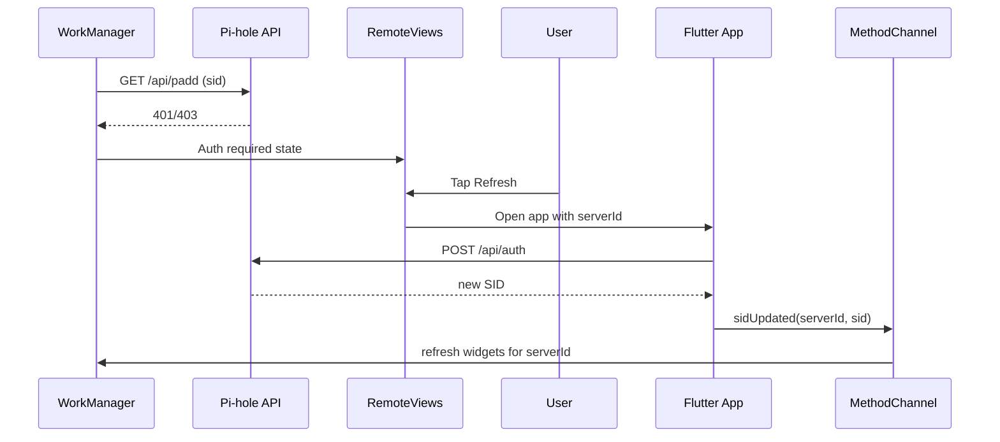

# Architecture Overview

This document describes the architecture that connects the Flutter app and the
Android home widget for the Pi-hole Client. The design splits responsibilities
so the widget stays lightweight and safe while the Flutter app remains the
single owner of authentication state. The widget provides quick status
visibility and basic actions without opening the app, and each widget instance
can target a different Pi-hole server. The system solves the "check and toggle
without opening the app" use case while preventing credential leakage and
uncontrolled auth flows. The Android side renders RemoteViews and performs
read/write API calls using only stored SID values for v6. Flutter manages SID
lifecycle, server metadata, and the authoritative server list.

## Components

## Flutter side

- Providers
  - `ServersProvider` owns the server list and selected server state. It is
    responsible for switching the active server in-app when a widget launch
    intent requests a specific serverId.
  - `StatusUpdateService` refreshes the app UI and provides the same status
    metrics the widget consumes.
- Gateways
  - `ApiGatewayV6` performs authenticated requests and owns login/refresh
    logic. It sends widget SID updates, invalidations, and blocking updates
    through the bridge.
  - `ApiGatewayV5` performs v5 requests and also notifies the widget when
    blocking is toggled.
- SID management
  - Session IDs are stored in `flutter_secure_storage` and cached in
    `SecureDataRepository`.
  - Flutter is the only component allowed to authenticate or refresh SID
    values.

## Android side

- `AppWidgetProvider`
  - Receives refresh/toggle actions and schedules work.
  - Handles widget lifecycle and delete events.
- Renderer (`WidgetRenderer`)
  - Maps WidgetState to RemoteViews for display and actions.
- WorkManager (`PiHoleWidgetWorker`)
  - Performs network calls for v6 using `/api/padd`, and sends toggle requests
    using `/api/dns/blocking`.
  - v5 is treated as a fallback display only (no API calls).
  - Updates WidgetState after each run.
- Networking (`PiHoleApiClient`)
  - Executes HTTP requests with the stored SID (no password access).
  - Handles self-signed certificate opt-in based on stored server metadata.

## Storage

- `flutter_secure_storage`
  - Stores passwords and SIDs. Used only by Flutter.
- SharedPreferences (Android widget)
  - Stores `serverId`-to-`sid` mapping and validity flags.
  - Stores per-widget selection (widgetId -> serverId).
  - Stores server metadata (alias/address/apiVersion/self-signed).

## Data Flow



Widget refresh flow: the widget schedules a WorkManager task. The worker calls
Pi-hole APIs using only the stored SID, then renders the RemoteViews.



Toggle blocking flow: the toggle action triggers a WorkManager task that POSTs
the new blocking state and then updates the widget UI.



App-side toggle flow: when the blocking state is changed inside the Pi-hole
client, Flutter notifies Android through `blockingUpdated`, which triggers a
widget refresh.



SID expired flow: the widget detects auth failure (401/403) and shows
"Authentication required." The refresh button opens the app. Flutter
re-authenticates and notifies Android to refresh the widget.

## Authentication and Session (SID)

- SID is stored in Android SharedPreferences as `sid_<serverId>` with
  `sid_valid_<serverId> = true/false`.
- The widget treats HTTP 401/403 or "unauthorized/forbidden" responses as SID
  invalid.
- The widget never calls the auth API. This prevents credential exposure and
  avoids duplicate login logic in two codebases.
- Flutter re-authenticates via the auth API and pushes the new SID to Android
  with the bridge.

## Multi-server Support

- `serverId` is the unique identifier used by the widget. The current
  implementation uses `Server.address` as serverId.
- Each widget instance stores its own selected server:
  - `active_server_id_widget_<widgetId> = <serverId>`
- The configuration activity lists all known servers and binds the selected
  serverId to the widgetId. v5 servers are selectable but display fallback
  state in the widget.
- SharedPreferences data example:

```text
active_server_id_widget_101 = http://192.168.1.2
sid_http://192.168.1.2 = abcd1234
sid_valid_http://192.168.1.2 = true
server_alias_http://192.168.1.2 = Home Pi-hole
server_address_http://192.168.1.2 = http://192.168.1.2
server_api_version_http://192.168.1.2 = v6
server_allow_self_signed_http://192.168.1.2 = false
```

- Default and last-selected server remain an app concern; the widget always
  uses its own stored serverId.

## Flutter ↔ Android Bridge

## Android → Flutter (launch intent)

- The widget launches `MainActivity` with an extra `serverId`.
- Both cold start and `onNewIntent` must be handled.
- Android forwards `serverId` to Flutter using MethodChannel `pihole/widget`
  (`openServer`).
- Flutter applies `serverId` after providers are initialized:
  - Find server by `serverId`
  - `ServersProvider.setselectedServer(...)`
  - Trigger `loginQuery()` and refresh services

## Flutter → Android (SID updates)

- Flutter sends `sidUpdated`, `sidInvalidated`, `serversUpdated`, and
  `blockingUpdated` through MethodChannel.
- This is the chosen mechanism because it is immediate, single-directional,
  and does not depend on background receivers.
- Android updates SharedPreferences and schedules widget refreshes.

## Background Updates

- WorkManager is the recommended scheduler because it survives process death
  and respects battery constraints.
- Update frequency is set to 15-60 minutes (current implementation: 30 minutes).
- Manual refresh uses an immediate one-time WorkManager request.
- The widget does not need live, high-frequency updates; a gentle schedule
  balances accuracy and battery impact.

## UI States

Each state includes icon/background styling and action availability:

- Blocking ON
  - Shield icon: on (`widget_icon_shield_on`)
  - Toggle background: on (`widget_action_button_on`)
  - Actions: toggle/refresh enabled
- Blocking OFF
  - Shield icon: off (`widget_icon_shield_off`)
  - Toggle background: off (`widget_action_button_off`)
  - Actions: toggle/refresh enabled
- Disconnected / Error
  - Shield icon: disabled (`widget_icon_shield_disabled`)
  - Toggle background: disabled (`widget_action_button_disabled`)
  - Actions: toggle/refresh disabled
- Authentication required
  - Shield icon: disabled (`widget_icon_shield_disabled`)
  - Toggle background: disabled (`widget_action_button_disabled`)
  - Actions: toggle disabled
  - Refresh opens the app instead of making API calls
- Loading / Updating
  - Shown implicitly while WorkManager is running; use last known values until
    refreshed.

## Error Handling and Observability

- Network failures show `Error / Disconnected` and do not retry aggressively.
- WorkManager provides system-managed backoff on failures.
- Logging should be verbose in debug builds and minimal in release builds.
- Crash reporting can be integrated later, but is not required for the widget
  to function.

## Non-goals

- Do not handle passwords in the widget.
- Do not call the auth API from the widget.
- Do not update at high frequency.
- Do not embed Flutter UI in the widget.

## Implementation Notes

- Suggested file layout:
  - Flutter: `lib/utils/widget_channel.dart`
  - Android: `android/app/src/main/kotlin/.../widget/*`
- Naming conventions:
  - `serverId`: unique server key (currently server address)
  - `sid_*`: SID storage by serverId
  - `active_server_id_widget_*`: widget-to-server mapping
- Known pitfalls:
  - Cold start vs `onNewIntent`: both must forward serverId.
  - Process death: widget must remain functional using only SharedPreferences.
  - Doze mode: WorkManager updates may be delayed.
