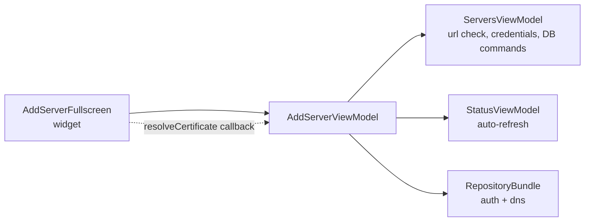
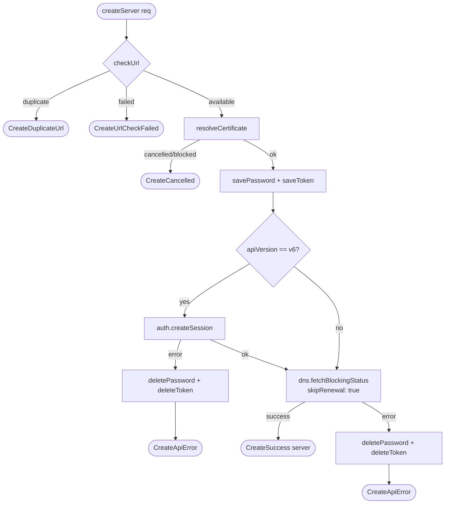
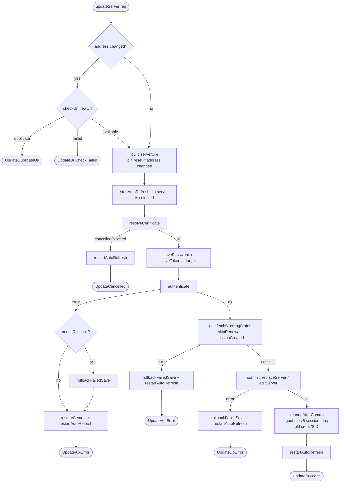
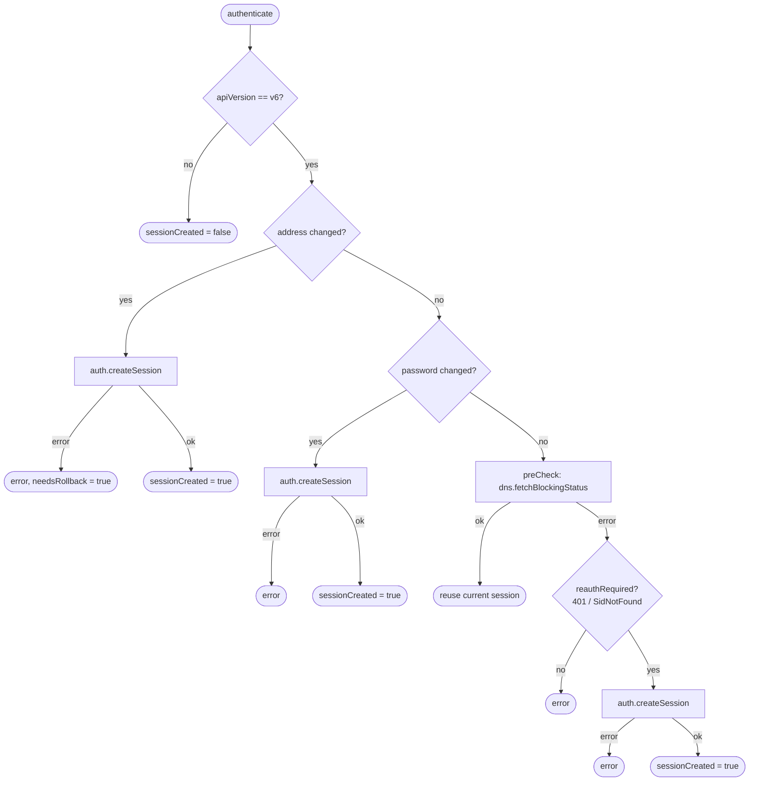
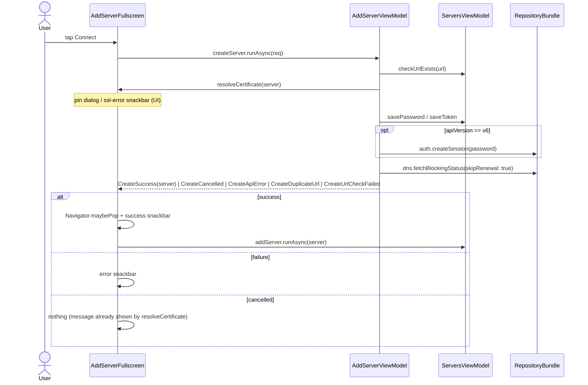
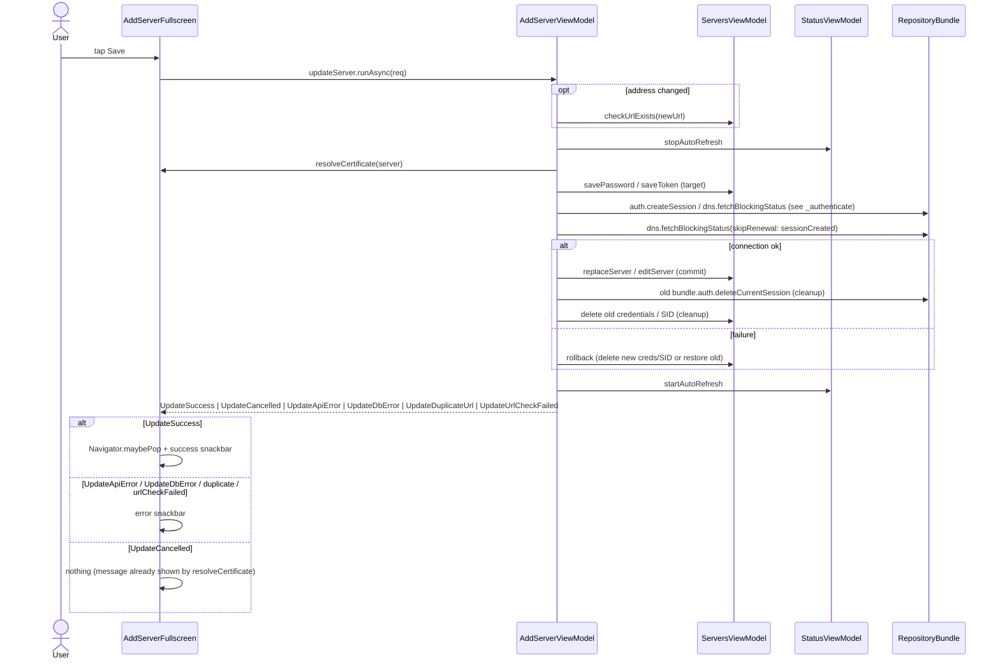

# Server Connection Flow (add / edit)

How the **Add / Edit server** screen connects to a Pi-hole and persists it.

- UI: `lib/ui/servers/widgets/add_server_fullscreen.dart` (`AddServerFullscreen`)
- Orchestration: `lib/ui/servers/view_models/add_server_viewmodel.dart`
  (`AddServerViewModel.createServer` / `updateServer`)

The view model owns the orchestration and returns a sealed outcome
(`CreateOutcome` / `UpdateOutcome`). The widget builds the request, awaits the
command and maps the outcome to UI (snackbar / navigation). The certificate
dialog and the SSL-error snackbar stay in the widget and are injected per
request through the `resolveCertificate` callback.

## Layers



## Add a new server - `createServer`

A cancelled/blocked certificate **aborts** the add (`CreateCancelled`),
mirroring `updateServer`; no credentials or remote session are created before
the abort.



On `CreateSuccess` the widget pops, shows the success snackbar, then persists
the server (`serversViewModel.addServer.runAsync`, fire-and-forget).

## Edit an existing server - `updateServer`

A cancelled/blocked certificate **aborts** the save (`UpdateCancelled`); the
message was already shown by `resolveCertificate`. Auto-refresh is stopped for
the duration and restarted on every exit path.



On `UpdateSuccess` the widget pops and shows the success snackbar.

### Session handling inside `updateServer` - `_authenticate`

Only re-authenticates when needed, to avoid duplicate sessions on transient
failures (503/504/timeout).



## Sequence - add a new server



## Sequence - edit an existing server



## Outcome → UI mapping

| Outcome                                         | Widget reaction                                                        |
| ----------------------------------------------- | ---------------------------------------------------------------------- |
| `CreateSuccess(server)`                         | pop → "connected successfully" → `addServer.runAsync(server)`          |
| `UpdateSuccess`                                 | pop → "edited successfully"                                            |
| `CreateDuplicateUrl` / `UpdateDuplicateUrl`     | "connection already exists" snackbar                                   |
| `CreateUrlCheckFailed` / `UpdateUrlCheckFailed` | "cannot check URL" snackbar                                            |
| `CreateApiError` / `UpdateApiError`             | status-code-specific error snackbar + log (`handleApiErrorResult`)     |
| `UpdateDbError`                                 | "cannot save connection data" snackbar                                 |
| `CreateCancelled` / `UpdateCancelled`           | nothing - the certificate dialog / SSL error already informed the user |

## Notes

- **Create and edit behave symmetrically on certificate cancel**: both
  `createServer` and `updateServer` abort (`CreateCancelled` / `UpdateCancelled`)
  when the pin dialog is cancelled or the certificate is blocked; no connection
  is attempted.
- The view model never shows UI itself. The certificate pin dialog and SSL-error
  snackbar live in the widget and are reached via the `resolveCertificate`
  callback passed in the request.
- The connecting overlay is driven by a local `isConnecting` flag toggled around
  `runAsync`.
- See also: [ARCHITECTURE.md](ARCHITECTURE.md).
```
