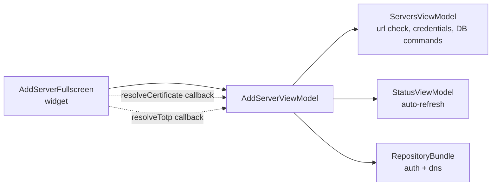
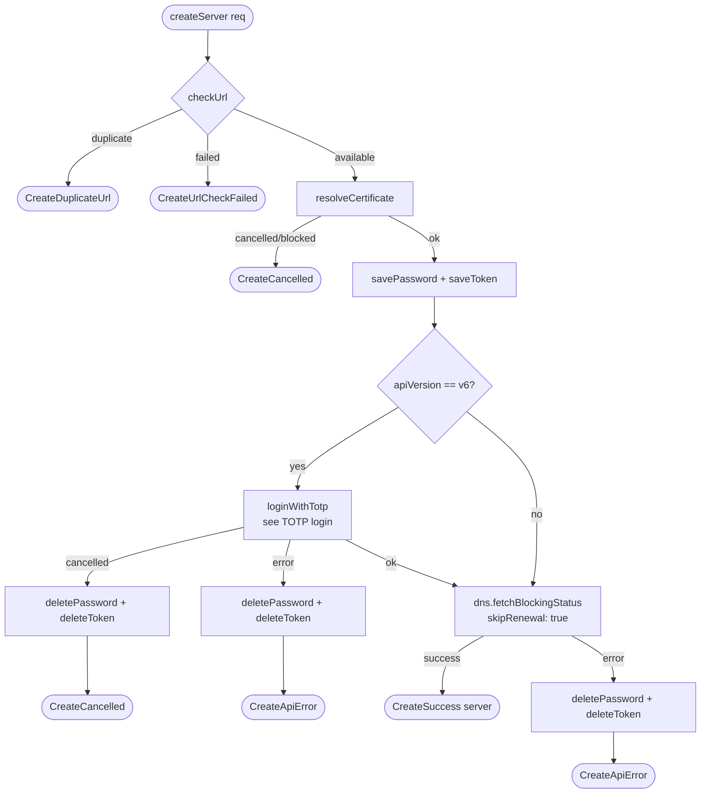
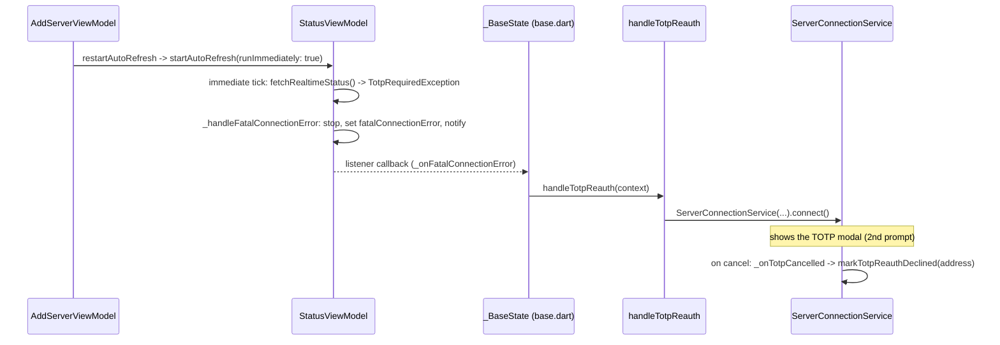
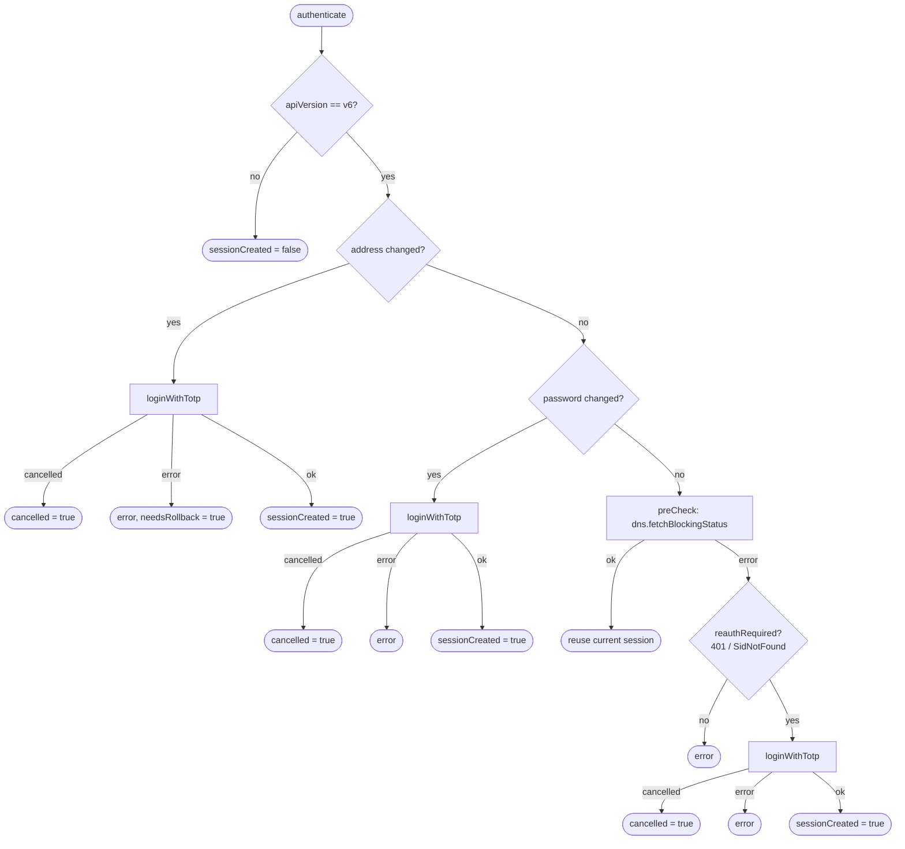
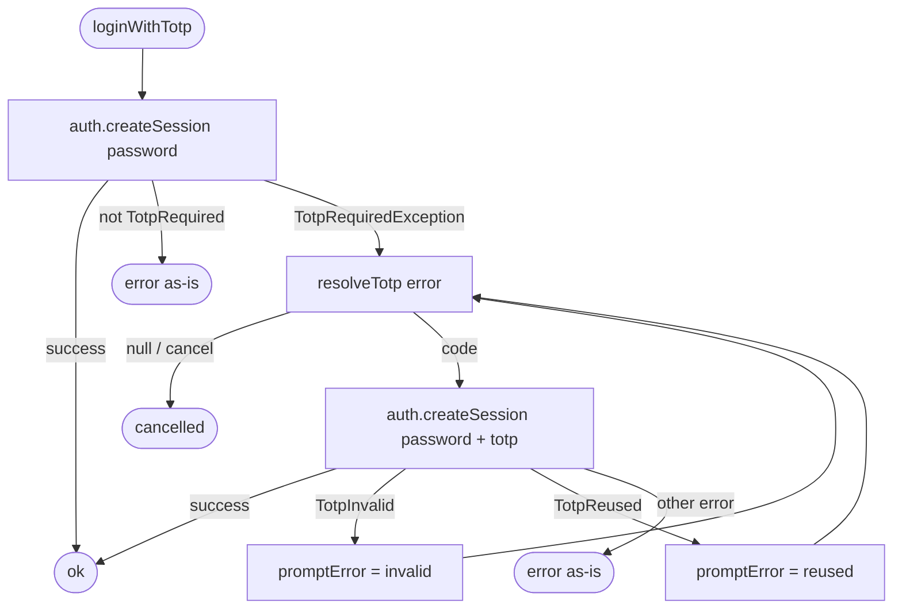
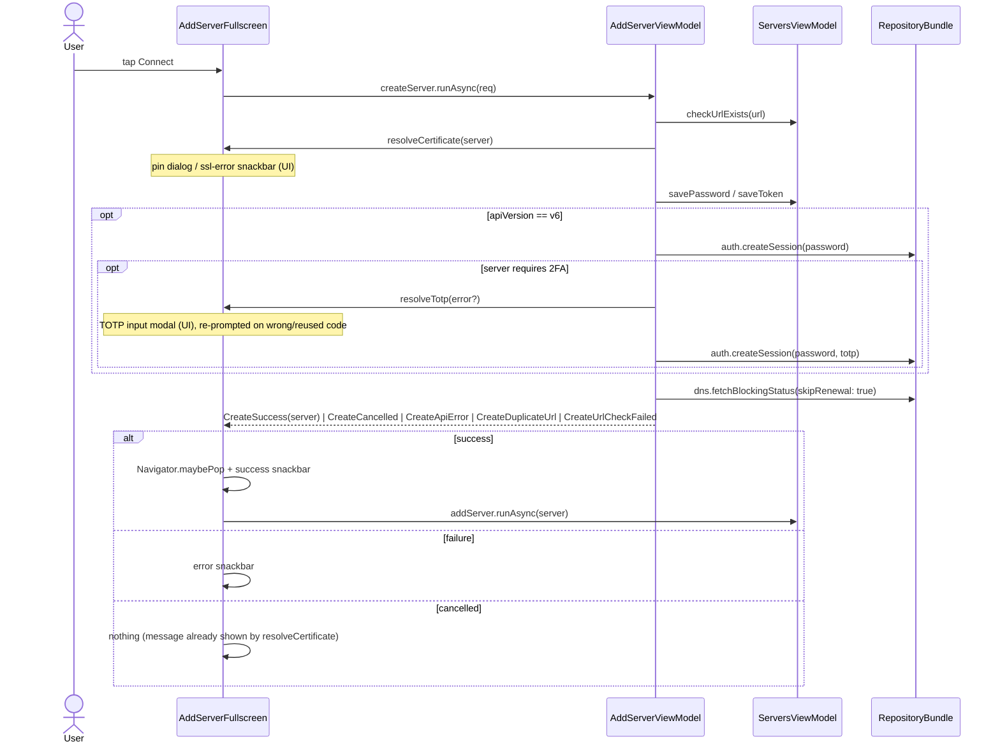
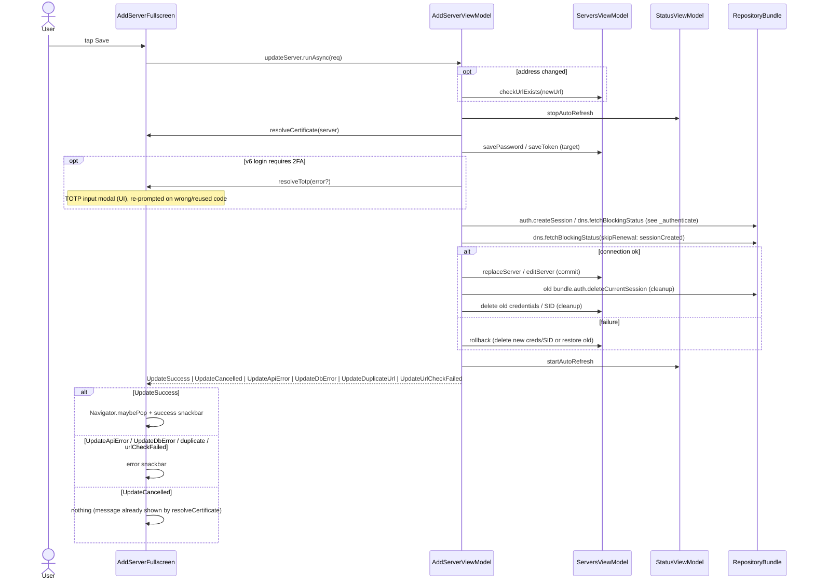

# Server Connection Flow (add / edit)

How the **Add / Edit server** screen connects to a Pi-hole and persists it.

- UI: `lib/ui/servers/widgets/add_server_fullscreen.dart` (`AddServerFullscreen`)
- Orchestration: `lib/ui/servers/view_models/add_server_viewmodel.dart`
  (`AddServerViewModel.createServer` / `updateServer`)

The view model owns the orchestration and returns a sealed outcome
(`CreateOutcome` / `UpdateOutcome`). The widget builds the request, awaits the
command and maps the outcome to UI (snackbar / navigation). UI that the
orchestration needs mid-flow is injected per request as callbacks, so the view
model never touches `BuildContext`:

- `resolveCertificate` — the certificate pin dialog + SSL-error snackbar.
- `resolveTotp` — the 6-digit TOTP (2FA) input modal, used on v6 login when the
  server requires two-factor auth. Returns the entered code or `null` on cancel.

## Layers



## Add a new server - `createServer`

A cancelled/blocked certificate **aborts** the add (`CreateCancelled`),
mirroring `updateServer`; no credentials or remote session are created before
the abort. A cancelled TOTP prompt aborts the same way (`CreateCancelled`),
rolling back the just-saved credentials.



On `CreateSuccess` the widget pops, shows the success snackbar, then persists
the server (`serversViewModel.addServer.runAsync`, fire-and-forget).

## Edit an existing server - `updateServer`

A cancelled/blocked certificate **aborts** the save (`UpdateCancelled`); the
message was already shown by `resolveCertificate`. Auto-refresh is stopped for
the duration and restarted on every exit path.


On `UpdateSuccess` the widget pops and shows the success snackbar.

### `restartAutoRefresh` can trigger a second, independent TOTP prompt

`restartAutoRefresh` (called on every `updateServer` exit path, including
`UpdateCancelled`) just calls `StatusViewModel.startAutoRefresh()` — but that
runs its first tick **immediately** (`runImmediately: true`), not after the
configured interval. If the edit's own `_authenticate`/`_loginWithTotp` TOTP
prompt is dismissed because the session is genuinely invalid server-side, that
immediate tick re-fetches status for the same server, hits the same
`TotpRequiredException`, and — via a completely separate subsystem outside
this file — surfaces a **second** TOTP prompt. Cancelling the edit's own
prompt does not (currently — see `(E8)`/`(E9)`/`(X6)` in the MFA decision
table) mark the address as reauth-declined, so this second prompt is not
suppressed.

The second prompt does not come back through `AddServerViewModel`; it is
raised by the shell-level auto-refresh error handler and goes through the
connect/switch flow instead:



Confirmed on a real device (not just the fake-server test): the two prompts
appear back-to-back, deterministically, every time — not a timing
coincidence. See `lib/ui/shell/base.dart` (`_onFatalConnectionError`,
`StatusViewModel` listener registered in `initState`) and
`lib/ui/core/actions/handle_totp_reauth.dart`.

### Session handling inside `updateServer` - `_authenticate`

Only re-authenticates when needed, to avoid duplicate sessions on transient
failures (503/504/timeout). Every `createSession` step below goes through
`_loginWithTotp`, so any of them can prompt for a 2FA code; a cancelled prompt
returns `cancelled = true` and `updateServer` maps it to `UpdateCancelled`
(after rollback / restore + auto-refresh restart).



### TOTP login - `_loginWithTotp`

Shared by `createServer` and `_authenticate`. The first attempt sends the
password only; a 2FA server answers with `TotpRequiredException`, then the loop
collects a code via `resolveTotp` and retries with `password + totp`. A wrong or
reused code re-prompts (with a localized reason); a `null` code (user dismissed)
cancels. Rate-limit or any other error is terminal.



## Sequence - add a new server



## Sequence - edit an existing server



## Outcome → UI mapping

| Outcome                                         | Widget reaction                                                      |
| ----------------------------------------------- | -------------------------------------------------------------------- |
| `CreateSuccess(server)`                         | pop → "connected successfully" → `addServer.runAsync(server)`        |
| `UpdateSuccess`                                 | pop → "edited successfully"                                          |
| `CreateDuplicateUrl` / `UpdateDuplicateUrl`     | "connection already exists" snackbar                                 |
| `CreateUrlCheckFailed` / `UpdateUrlCheckFailed` | "cannot check URL" snackbar                                          |
| `CreateApiError` / `UpdateApiError`             | status-code-specific error snackbar + log (`handleApiErrorResult`)   |
| `UpdateDbError`                                 | "cannot save connection data" snackbar                               |
| `CreateCancelled` / `UpdateCancelled`           | nothing - certificate dialog / SSL error / TOTP prompt already shown |

## Notes

- **Create and edit behave symmetrically on certificate cancel**: both
  `createServer` and `updateServer` abort (`CreateCancelled` / `UpdateCancelled`)
  when the pin dialog is cancelled or the certificate is blocked; no connection
  is attempted.
- The view model never shows UI itself. The certificate pin dialog and SSL-error
  snackbar live in the widget and are reached via the `resolveCertificate`
  callback passed in the request.
- **TOTP (2FA) is v6-only and handled inside login** (`_loginWithTotp`, shared by
  `createServer` and `_authenticate`). The view model never shows the prompt; it
  calls the injected `resolveTotp` callback, which the widget backs with the TOTP
  input modal. Wrong / reused codes re-prompt with a localized reason; a
  dismissed prompt cancels the whole flow (`CreateCancelled` / `UpdateCancelled`).
- The connecting overlay is driven by a local `isConnecting` flag toggled around
  `runAsync`.
- See also: [ARCHITECTURE.md](ARCHITECTURE.md).
```
