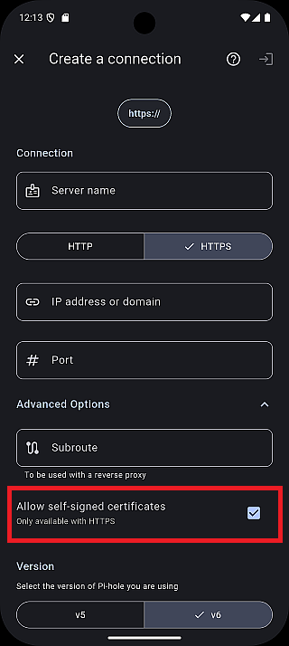
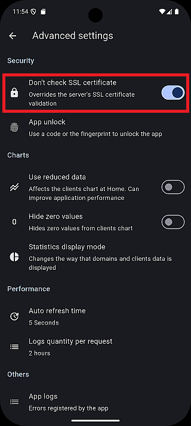

# Connecting to Your Pi-hole

On this page, there are explained all the instructions about how to create a
connection to the server with different circumstances. These are the most common
cases. There may be other configurations that aren't covered by this guide.

## ⚙️ Common settings

- **Version**: You can choose between `v5` and `v6 (default)`. The latest
version is `v6`, while the previous generation is `v5`.
- **Authentication**:
   - **v5**: Requires an API **token** (See: [Getting the API token (v5 only)](../get-api-token)).
   - **v6**: Requires a **password** to log in to the web UI.

## 1. Basic connection

The simplest case. The Pi-hole server usually is installed on a Raspberry Pi
and the web administration panel is on the default port (80).

- **IP address or domain:** your Pi-hole server IP or domain
- **Subroute:** empty
- **Port:** empty
- **HTTP/HTTPS:** HTTP

## 2. Basic connection with custom port

The Pi-hole server is usually installed on a Docker container or virtual machine.

- **IP address or domain:** your Pi-hole server IP or domain
- **Subroute:** empty
- **Port:** the port you are using for the web administration panel
- **HTTP/HTTPS:** HTTP

## 3. HTTPS connection 🔒

You have enabled HTTPS connections on your Pi-hole server config, but you access
it using the default HTTPS port (443).

- **IP address or domain:** your Pi-hole server IP or domain
- **Subroute:** empty
- **Port:** empty
- **HTTP/HTTPS:** HTTPS

:::info
If you are using **Pi-hole v6** with a **self-signed SSL certificate**, the connection may fail if self-signed certificates are not allowed.
**To prevent SSL certificate validation errors**, please follow the steps below based on your app version:

**App version >= v1.3.0**
1. Go to: `Settings > Servers`
2. Select an existing server or create a new one
3. Check **Allow self-signed certificates** (`default: checked`)

**App version < v1.3.0**
1. Go to: `Settings > Advanced settings > Don't check SSL certificate`
2. Turn it `ON` (default: `ON`)
3. Restart the application

Once the app restarts, you can proceed with the connection.

:::

## 4. HTTPS connection with custom port (or exposed port) 🔒

You have enabled HTTPS connections on your Pi-hole server config and you have an exposed port on your router to access it.

- **IP address or domain:** your Pi-hole server IP or domain
- **Subroute:** empty
- **Port:** the port you are exposing for the web administration panel
- **HTTP/HTTPS:** HTTPS

## 5. HTTPS connection with reverse proxy ⚡

You have your Pi-hole server behind a reverse proxy.

- **IP address or domain:** your Pi-hole server IP or domain
- **Subroute:** the route you are using on your reverse proxy to access Pi-hole web administration panel
- **Port:** empty
- **HTTP/HTTPS:** HTTPS

:::warning
Currently, connections via a reverse proxy have not been tested, and their operation is not guaranteed.
:::
