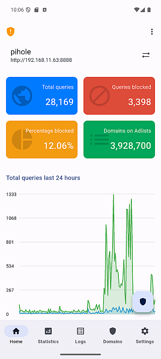
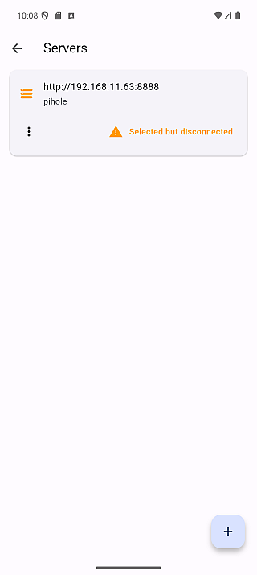
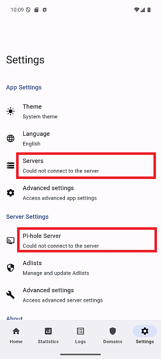

import imgServerMenu from "../guides/images/cert-config/server-menu-view-update-cert.png";
import imgCertUpdate from "../guides/images/cert-config/cert-update.png";

# 🤔 FAQ

## ❓ Q1. The app frequently disconnects or fails to fetch status

| home                   | servers                   | settings                   |
| ---------------------- | ------------------------- | -------------------------- |
|  |  |  |

### 💡 Answer

On certain devices, the app may occasionally fail to connect to your Pi-hole
server during automatic refresh.
This can happen when the refresh timing aligns poorly with how long the server
keeps connections open.

### 🛠 Temporary Workaround

**Try adjusting the auto-refresh interval in the app settings.**

Using exact round numbers like **"5 seconds" (5000 ms)** may increase the chance
of connection issues.
Shifting the interval slightly **up or down** can help avoid this.

#### ❌ Avoid

- 5 seconds (5000 ms)

#### ✅ Recommended

- 4 seconds (4000 ms)
- 6 seconds (6000 ms)

> Since version 1.5.0, the app automatically adds a small buffer to avoid this
> issue, but manual adjustment may still help in some cases.

### 🔧 Optional Tip

If you continue to experience this issue, feel free to
[open an issue](https://github.com/tsutsu3/pi-hole-client/issues).
We're working to improve the reliability across all environments.

---

## ❓ Q2. "Connection failed" with self-signed certificate

### 💡 Answer

1. Check if **"Allow self-signed certificates"** is enabled in server settings
2. If using Docker, try enabling **"Don't check SSL certificate"**
3. Verify the server URL is correct

For more details, see the [Certificate Configuration Guide](../../guides/cert-config).

---

## ❓ Q3. Certificate pin mismatch after server certificate update

### 💡 Answer

If you renewed or regenerated your server's certificate, the app will detect that the fingerprint no longer matches and block the connection.

**To fix this:**

1. Go to server settings
2. Open the server menu and select **"Update"**

3. Verify the new fingerprint is legitimate and tap **"Update"**

4. The server will now show "HTTPS Pinned" status with the new fingerprint

:::danger
If you didn't change your certificate, this could indicate a security issue.
Verify your server's certificate before updating the pin.
:::

---

## ❓ Q4. Warning banner about unverified certificates keeps appearing

### 💡 Answer

The warning banner appears when you have servers with **"HTTPS Untrusted Allowed"** status.

**To resolve this:**

1. **Pin the certificate** for those servers (recommended) - tap on the server to trigger the pinning flow
2. Or tap **"Dismiss"** on the banner (not recommended as it reduces security awareness)

For more details, see the [Certificate Configuration Guide](../../guides/cert-config).
