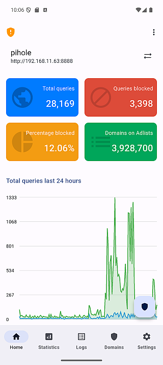
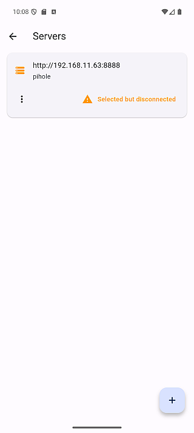
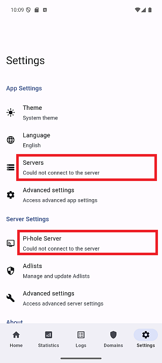

import imgServerMenu from "../guides/images/cert-config/server-menu-view-update-cert.png";
import imgCertUpdate from "../guides/images/cert-config/cert-update.png";
import imgWidgetOffline from "../user-manual/images/widget/home-widget-offline.png";

# 🤔 FAQ

## ❓ Q1. The app frequently disconnects or fails to fetch status

| home                   | servers                   | settings                   |
| ---------------------- | ------------------------- | -------------------------- |
|  |  |  |

### 💡 Answer

On certain devices, the app may occasionally fail to connect to your Pi-hole
server during automatic refresh.
This can happen when the refresh timing aligns poorly with how long the server
keeps connections open.

### 🛠 Temporary Workaround

**Try adjusting the auto-refresh interval in the app settings.**

Using exact round numbers like **"5 seconds" (5000 ms)** may increase the chance
of connection issues.
Shifting the interval slightly **up or down** can help avoid this.

#### ❌ Avoid

- 5 seconds (5000 ms)

#### ✅ Recommended

- 4 seconds (4000 ms)
- 6 seconds (6000 ms)

> Since version 1.5.0, the app automatically adds a small buffer to avoid this
> issue, but manual adjustment may still help in some cases.

### 🔧 Optional Tip

If you continue to experience this issue, feel free to
[open an issue](https://github.com/tsutsu3/pi-hole-client/issues).
We're working to improve the reliability across all environments.

---

## ❓ Q2. SSL error with a valid Let's Encrypt certificate

### 💡 Answer

If the certificate works fine in a browser but the app shows an SSL error, the cause is likely an **incomplete certificate chain**.

Unlike browsers, Flutter's HTTP client requires the server to provide the **full certificate chain**. This happens when the server is configured with `cert.pem` instead of `fullchain.pem`.

Pi-hole requires a single combined PEM file containing both the certificate and the private key.
The fix is to use `fullchain.pem` (not `cert.pem`) when creating this file.

**Pi-hole v6:**

```bash
cat /etc/letsencrypt/live/yourdomain.com/fullchain.pem \
    /etc/letsencrypt/live/yourdomain.com/privkey.pem \
    > /etc/pihole/tls.pem
```

If you cannot fix the server immediately, enable **"Allow untrusted certificates"** in server settings as a temporary workaround.

For full instructions, see [SSL Error with a Valid Let's Encrypt Certificate](../../guides/cert-config#ssl-error-with-a-valid-lets-encrypt-certificate-incomplete-chain).

---

## ❓ Q3. "Connection failed" with self-signed certificate

### 💡 Answer

1. Check if **"Allow untrusted certificates"** is enabled in server settings
2. If using Docker, try enabling **"Don't check SSL certificate"**
3. Verify the server URL is correct

For more details, see the [Certificate Configuration Guide](../../guides/cert-config).

---

## ❓ Q4. Certificate pin mismatch after server certificate update

### 💡 Answer

If you renewed or regenerated your server's certificate, the app will detect that the fingerprint no longer matches and block the connection.

**To fix this:**

1. Go to server settings
2. Open the server menu and select **"Update"**


3. Verify the new fingerprint is legitimate and tap **"Update"**


4. The server will now show "HTTPS Pinned" status with the new fingerprint

:::danger
If you didn't change your certificate, this could indicate a security issue.
Verify your server's certificate before updating the pin.
:::

---

## ❓ Q5. Warning banner about unverified certificates keeps appearing

### 💡 Answer

The warning banner appears when you have servers with **"HTTPS Untrusted Allowed"** status.

**To resolve this:**

1. **Pin the certificate** for those servers (recommended) - tap on the server to trigger the pinning flow
2. Or tap **"Dismiss"** on the banner

For more details, see the [Certificate Configuration Guide](../../guides/cert-config).

---

## ❓ Q6. Android Home Widget shows offline or error state


### 💡 Answer

The widget may show an offline or error state for several reasons:

- **Session expired**: Pi-hole v6 uses session-based authentication (SID). The session expires after a period of inactivity.
- **Screen off for extended time**: Background connections may be lost when your device has been idle for a long time.
- **Server unreachable**: The Pi-hole server may be offline or network connectivity is interrupted.

### 🛠 How to Fix

**Tap the widget to launch the app and reconnect.**

1. Tap anywhere on the widget
2. The app opens and automatically connects to the server associated with that widget
3. Once connected, return to your Home screen
4. The widget will update with the latest status

For more details, see the [Android Home Widget Guide](../../user-manual/android-home-widget).
