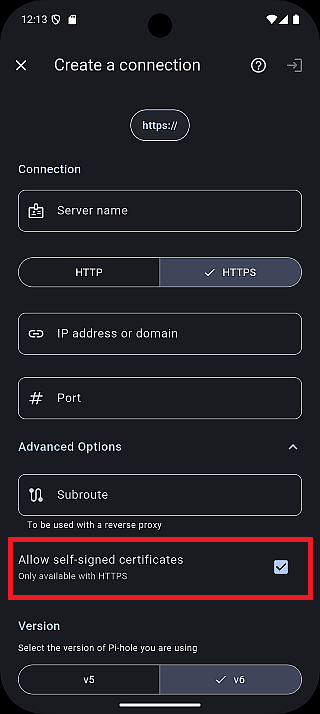
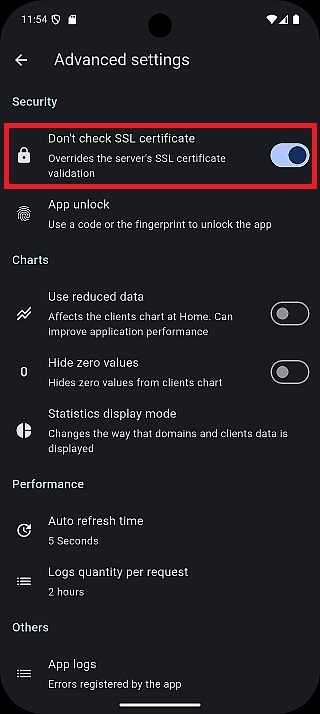

このページでは、さまざまな環境でPi-holeサーバーへの接続を作成する方法を説明します。ここでは一般的な構成を取り上げています。お使いの環境によっては、このガイドに記載されていない設定が必要な場合があります。

## ⚙️ 共通設定

- **バージョン**：`v5` と `v6（既定）` から選択できます。最新バージョンは `v6`、従来バージョンは `v5` です。
- **認証**：
  - **v5**：API **トークン**が必要です（[APIトークンの取得（v5のみ）](../get-api-token/)を参照）。
  - **v6**：Web管理画面へのログインに使用する**パスワード**が必要です。

:::caution
アプリv1.9.xの既知の問題

アプリのバージョン **1.9.0～1.9.2** では、**パスワードが設定されていないPi-hole v6** サーバーに接続できません。これはリグレッションで、**v1.10.0** で修正予定です。

修正版が公開されるまでは、Pi-holeにパスワードを設定し、アプリにも同じパスワードを入力してください。詳しくは[FAQ Q8](../../help/faq/#-q8-pi-hole-v6-cannot-connect-when-no-password-is-set)を参照してください。
:::

## 1. 基本的な接続

最もシンプルな構成です。通常、Pi-holeサーバーはRaspberry Piにインストールされ、Web管理画面は既定のポート（80）で動作します。

- **IPアドレスまたはドメイン**：Pi-holeサーバーのIPアドレスまたはドメイン
- **サブルート**：空欄
- **ポート**：空欄
- **HTTP/HTTPS**：HTTP

## 2. カスタムポートを使用する基本的な接続

Pi-holeサーバーをDockerコンテナや仮想マシンにインストールしている場合によく使用する構成です。

- **IPアドレスまたはドメイン**：Pi-holeサーバーのIPアドレスまたはドメイン
- **サブルート**：空欄
- **ポート**：Web管理画面で使用しているポート
- **HTTP/HTTPS**：HTTP

## 3. HTTPS接続 🔒

Pi-holeサーバーでHTTPSを有効にし、既定のHTTPSポート（443）でアクセスする構成です。

- **IPアドレスまたはドメイン**：Pi-holeサーバーのIPアドレスまたはドメイン
- **サブルート**：空欄
- **ポート**：空欄
- **HTTP/HTTPS**：HTTPS

:::note
**自己署名SSL証明書**を使用する **Pi-hole v6** では、信頼されていない証明書を許可していないと接続に失敗することがあります。**SSL証明書の検証エラーを防ぐには**、アプリのバージョンに応じて次の手順を実行してください。

**アプリバージョン v1.3.0以降**

1. `設定 > サーバー` を開きます。
2. 既存のサーバーを選択するか、新しいサーバーを作成します。
3. **信頼されていない証明書を許可する**をオンにします（既定：オン）。

**アプリバージョン v1.3.0未満**

1. `設定 > 高度な設定 > SSL証明書を確認しない` を開きます。
2. オンにします（既定：オン）。
3. アプリを再起動します。

再起動後、接続を続行できます。

:::

## 4. カスタムポート（または公開ポート）を使用するHTTPS接続 🔒

Pi-holeサーバーでHTTPSを有効にし、ルーターで公開したポートからアクセスする構成です。

- **IPアドレスまたはドメイン**：Pi-holeサーバーのIPアドレスまたはドメイン
- **サブルート**：空欄
- **ポート**：Web管理画面用に公開しているポート
- **HTTP/HTTPS**：HTTPS

## 5. リバースプロキシを使用するHTTPS接続 ⚡

Pi-holeサーバーをリバースプロキシの背後で運用している構成です。

- **IPアドレスまたはドメイン**：Pi-holeサーバーのIPアドレスまたはドメイン
- **サブルート**：リバースプロキシからPi-holeのWeb管理画面へアクセスするためのパス
- **ポート**：空欄
- **HTTP/HTTPS**：HTTPS

:::caution
現在、リバースプロキシ経由の接続は十分にテストされておらず、動作は保証されません。
:::
