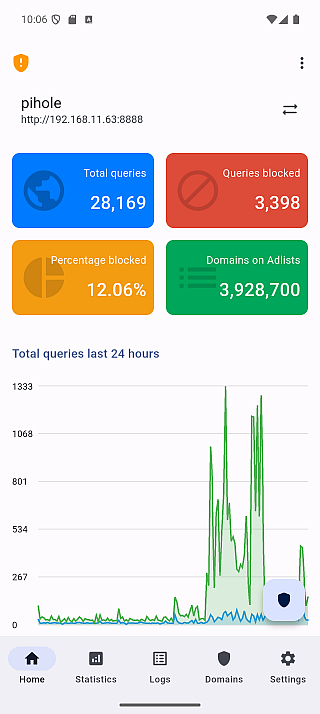
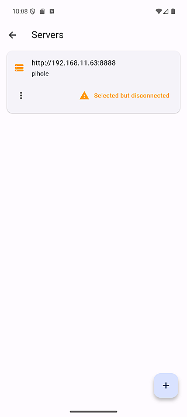

import DocImage from "@site/src/components/doc-image.astro";
import imgServerMenu from "../../../docs/guides/images/cert-config/server-menu-view-update-cert.png";
import imgCertUpdate from "../../../docs/guides/images/cert-config/cert-update.png";
import imgWidgetOffline from "../../../docs/user-manual/images/widget/home-widget-offline.png";

## ❓ Q1. 接続が頻繁に切れる、またはステータスを取得できない

| ホーム                                  | サーバー                                   | 設定                                        |
| --------------------------------------- | ------------------------------------------ | ------------------------------------------- |
|  |  |  |

### 💡 回答

一部の端末では、自動更新中にPi-holeサーバーへ接続できないことがあります。サーバーが接続を維持する時間と、アプリの更新タイミングがうまく合わない場合に発生します。

### 🛠 一時的な回避策

**アプリ設定で自動更新の間隔を調整してください。**

**「5秒」（5000ミリ秒）**のような切りのよい値では、接続問題が起きやすくなることがあります。間隔を少し**短くするか長くする**と、問題を回避できる場合があります。

#### ❌ 避ける値

- 5秒（5000ミリ秒）

#### ✅ 推奨する値

- 4秒（4000ミリ秒）
- 6秒（6000ミリ秒）

> バージョン1.5.0以降では、この問題を避けるためにアプリがわずかな余裕時間を自動的に追加します。それでも問題が発生する場合は、手動での調整が有効なことがあります。

### 🔧 その他のヒント

問題が解消しない場合は、[Issueを作成](https://github.com/tsutsu3/pi-hole-client/issues)してください。さまざまな環境での信頼性向上に取り組んでいます。

---

## ❓ Q2. 有効なLet's Encrypt証明書でSSLエラーが発生する

### 💡 回答

Webブラウザーでは問題なく接続できるのにアプリでSSLエラーが表示される場合、**証明書チェーンが不完全**である可能性があります。

ブラウザーとは異なり、FlutterのHTTPクライアントでは、サーバーが**完全な証明書チェーン**を提供する必要があります。サーバーで `fullchain.pem` ではなく `cert.pem` を設定している場合に発生します。

Pi-holeでは、証明書と秘密鍵の両方を含む単一のPEMファイルが必要です。このファイルを作成するときに、`cert.pem` ではなく `fullchain.pem` を使用してください。

**Pi-hole v6：**

```bash
cat /etc/letsencrypt/live/yourdomain.com/fullchain.pem \
    /etc/letsencrypt/live/yourdomain.com/privkey.pem \
    > /etc/pihole/tls.pem
```

すぐにサーバーを修正できない場合は、一時的な回避策として、サーバー設定で **「信頼されていない証明書を許可する」** を有効にしてください。

詳しい手順は、[有効なLet's Encrypt証明書でSSLエラーが発生する場合](../../guides/cert-config/#有効なlets-encrypt証明書でsslエラーが発生する場合不完全なチェーン)を参照してください。

---

## ❓ Q3. 自己署名証明書で「接続に失敗しました」と表示される

### 💡 回答

1. サーバー設定で **「信頼されていない証明書を許可する」** が有効になっているか確認します。
2. Dockerを使用している場合は、 **「SSL証明書を確認しない」** を有効にして接続を試します。
3. サーバーURLが正しいか確認します。

詳しくは[証明書設定ガイド](../../guides/cert-config/)を参照してください。

---

## ❓ Q4. サーバー証明書の更新後にピンの不一致が発生する

### 💡 回答

サーバー証明書を更新または再生成すると、フィンガープリントがピン留めした値と一致しなくなり、アプリが接続をブロックします。

**修正手順：**

1. サーバー設定を開きます。
2. サーバーメニューを開き、 **「更新」** を選択します。

<DocImage width="320" alt="更新項目を含むサーバーメニュー" src={imgServerMenu} />

3. 新しいフィンガープリントが正しいことを確認し、 **「更新」** をタップします。

<DocImage width="320" alt="ピン留めしたフィンガープリントの更新画面" src={imgCertUpdate} />

4. 新しいフィンガープリントが保存され、サーバーに「HTTPS（ピン留め）」ステータスが表示されます。

:::danger
証明書を変更していない場合は、セキュリティ上の問題を示している可能性があります。ピン留めを更新する前に、サーバー証明書を確認してください。
:::

---

## ❓ Q5. 未検証の証明書に関する警告バナーが消えない

### 💡 回答

「HTTPS（未検証 許可）」ステータスのサーバーがある場合に警告バナーが表示されます。

**解決方法：**

1. 対象のサーバーをタップし、画面の案内に従って**証明書をピン留め**します（推奨）。
2. または、バナーの **「閉じる」** をタップします。

詳しくは[証明書設定ガイド](../../guides/cert-config/)を参照してください。

---

## ❓ Q6. Androidホームウィジェットにオフラインまたはエラーが表示される

<DocImage width="320" alt="オフライン状態のウィジェット" src={imgWidgetOffline} />

### 💡 回答

次のような理由で、ウィジェットにオフラインまたはエラー状態が表示されることがあります。

- **セッションの期限切れ**：Pi-hole v6はセッションベースの認証（SID）を使用します。一定時間操作がないとセッションが期限切れになります。
- **長時間の画面オフ**：端末を長時間使用していないと、バックグラウンド接続が失われることがあります。
- **サーバーに接続できない**：Pi-holeサーバーが停止しているか、ネットワーク接続が中断されています。

### 🛠 修正方法

**ウィジェットをタップしてアプリを起動し、再接続してください。**

1. ウィジェットの任意の場所をタップします。
2. アプリが開き、そのウィジェットに設定されたサーバーへ自動的に接続します。
3. 接続後、端末のホーム画面へ戻ります。
4. ウィジェットが最新の状態に更新されます。

詳しくは[Androidホームウィジェットガイド](../../user-manual/android-home-widget/)を参照してください。

---

## ❓ Q7. Pi-hole v5：接続できるがブロックの有効・無効を切り替えられない

### 💡 回答

これは、**Webパスワードを設定していないPi-hole v5** サーバーで発生します。

v6とは異なり、v5 APIはパスワードが未設定でも認証を省略しません。空でないAPIトークンを含むリクエストを拒否します。そのため、接続設定の**トークン**欄に以前のトークンが残っていると（たとえば、以前はパスワードを設定していて後から削除した場合）、次の状態になります。

- 接続とステータスの取得は**成功**します（ステータスの取得には認証が不要です）。
- ブロックのオン・オフは **「サーバーを無効にできませんでした」** または **「サーバーを有効にできませんでした」** と表示され、失敗します。

### 🛠 修正方法

**トークンを削除してから再接続してください。**

1. サーバー設定を開き、接続情報を編集します。
2. **トークン欄の値を削除**して空欄にします。
3. 保存してサーバーへ再接続します。
4. ブロックのオン・オフを切り替えられるようになります。

:::note
パスワードを設定していないPi-hole **v5** サーバーでは、トークン欄を**空欄**にしてください。サーバーにパスワードを設定している場合にのみ、トークンを入力します。
:::

---

## ❓ Q8. Pi-hole v6：パスワードが未設定だと接続できない

:::note
アプリv1.10.0で修正済み

これはアプリのバージョン **1.9.0、1.9.1、1.9.2** で発生していたリグレッションです。**v1.10.0で修正済み** のため、1.9.xを使用している場合はアプリを更新してください。1.8.0以前のバージョンには影響しません。
:::

### 💡 回答

**Pi-hole v6** サーバーに**パスワードが設定されていない**場合（ログインせずにWeb管理画面が開く場合）、アプリv1.9.xから接続できません。サーバーの新規追加と、以前に追加したサーバーへの接続のどちらも接続エラーになります。

パスワードのないPi-hole v6は、ログイン要求に対し、有効ではあるものの `sid` と `csrf` を含まないセッションを返します。

```json
{
  "session": {
    "valid": true,
    "totp": false,
    "sid": null,
    "csrf": null,
    "validity": -1,
    "message": "no password set"
  }
}
```

アプリv1.9.xは両方の値が必ず含まれるものとして処理するため、この応答をエラーと判断し、接続を完了できません。

### 🛠 対処方法

**アプリをv1.10.0以降に更新してください。** v1.10.0以降は空のセッションを受け入れ、パスワードなしのPi-hole v6に接続できます。

すぐに更新できない場合は、Pi-holeにパスワードを設定し、アプリにも同じパスワードを入力してください。

1. Pi-holeのWeb管理画面を開き、`Settings > Web interface / API` へ移動します。
2. パスワードを設定します。
3. アプリで接続情報を編集し、同じパスワードを入力します。
